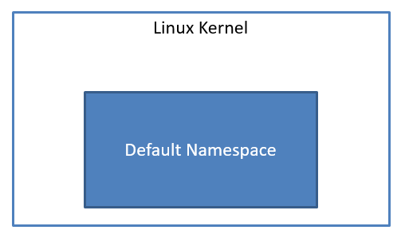
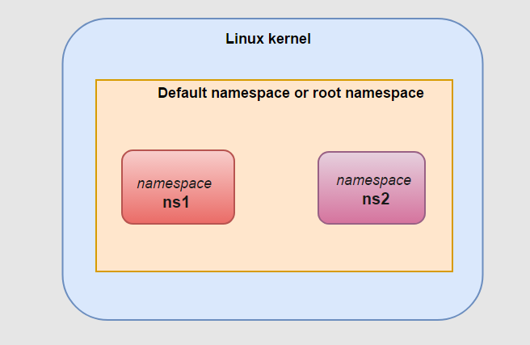
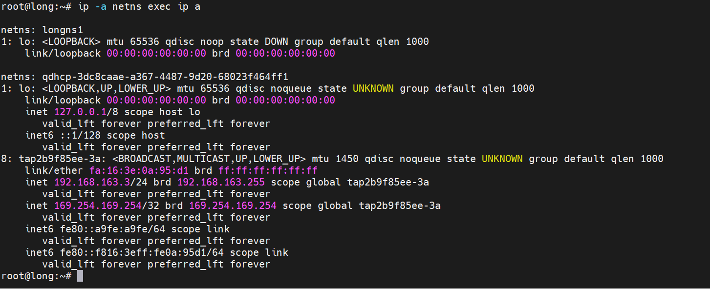
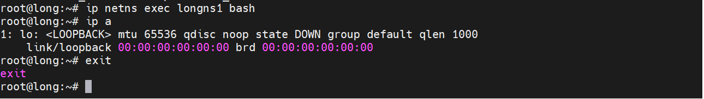

## 1. What is network namespace ?

- Network namespace help us to separate many network in 1 host.

- Each namespace have `interface` and `routing table` and separate with another namespace.

- Process in system can connect to a specify network-namespace.

## 2. Work in Network Namespace

- When start Linux, sys tem have a namespace and each process `inherit` this namespace from parent process. So all process `inherit` network-namespace from `init process` (PID = 1)



- List all `networknamespace`

```
# ip netns list

```

- Create a namespace

```
# ip netns add NAME_SPACE_NAME
# ip netns add ns1
# ip netns add ns2
```



- When a namespace have created a file have the same name with the namespace have created in `/var/run/netns`

- Execute a command in namespace:

```
# ip netns exec NAME_SPACE_NAME your_command

# ip netns exec qdhcp-3dc8caae-a367-4487-9d20-68023f464ff1 ip a

```

- `ip a` command run in `qdhcp-3dc8caae-a367-4487-9d20-68023f464ff1` namespace

- List all interface of namespace use `-a` or `-all` option:



- To use command witj namesapce use command bash to process command in specify namespace:

```
 ip netns exec <namespace_name> bash
 ip a #se chi hien thi thong tin trong namespace <namespace_name> 
```



- Delete a name space:

```
# ip netns delete NAMESPACE_NAME
```

## Reference
- [https://www.youtube.com/watch?v=j_UUnlVC2Ss](https://www.youtube.com/watch?v=j_UUnlVC2Ss)

- ip-netns(8) man page

- [https://docs.openstack.org/ocata/networking-guide/intro-network-namespaces.html](https://docs.openstack.org/ocata/networking-guide/intro-network-namespaces.html)

- [https://blog.scottlowe.org/2013/09/04/introducing-linux-network-namespaces/](https://blog.scottlowe.org/2013/09/04/introducing-linux-network-namespaces/)

- [https://github.com/hocchudong/thuctap012017/blob/master/TamNT/Virtualization/docs/7.Linux_network_namespace.md](https://github.com/hocchudong/thuctap012017/blob/master/TamNT/Virtualization/docs/7.Linux_network_namespace.md)
