# Interact with OpenStack

> You can login to Horizon by using `username: admin` and `password` is your keystone.

- Using this command to get your admin password.

```
$cat /etc/kolla/passwords.yml | grep keystone_admin
```

## 1. Create Network

- Go to `Admin` => select `Network` in Taskbar on the left => Select `Create Network` and fill text box like this to create new network.

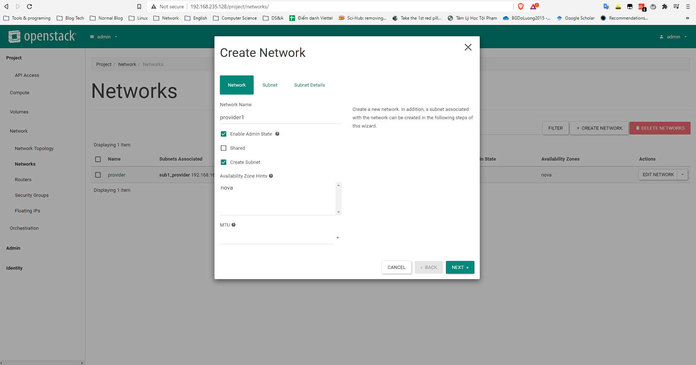

- Next, fill all information about your subnet.

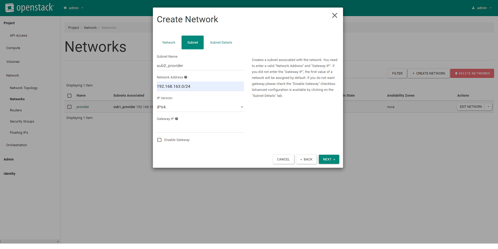

> You can leave your `gateway IP` blank. It's auto assign by your first ip address in your subnet.

- Then, config your `allocation pool` and `DNS`:

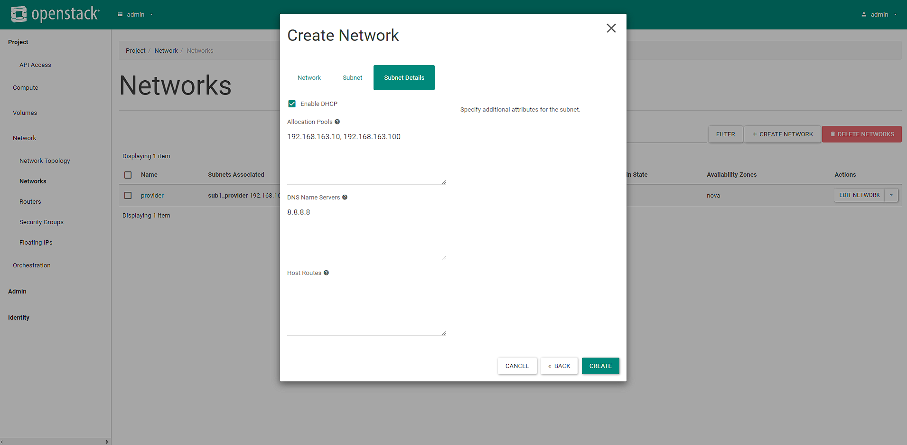

- Use CLI:

```
// create a network
$openstack network create NETWORK_NAME 

// Create a Subnet
$openstack subnet create --subnet-pool SUBNET --network NETWORK SUBNET_NAME

$openstack subnet create --subnet-pool 192.168.163.0/24 --network net1 subnet1

```

## 2. Create Flavor

- Go to `Admin` => select `Compute` => Select `Flavor` => `Create Flavor` => Fill all information you want when you deploy instances.

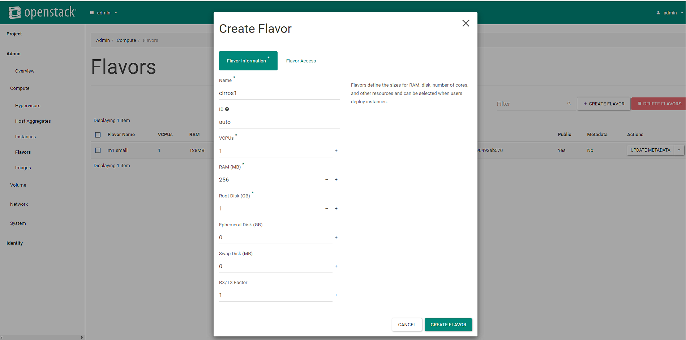

- Use CLI:

```
// create a flavor named m1.tiny with 512 MB ram, 1gb disk, 1 cpu

$openstack flavor create --ram 512 --disk 1 --vcpus 1 m1.tiny

// list all flavor

$openstack flavor list
```

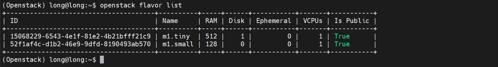

## 3. Create Image

- You can download a test image `CirrOS` [here](https://docs.openstack.org/image-guide/obtain-images.html)

> Note: In a CirrOS image, the login **account** is `cirros`. The **password** is `gocubsgo`.

- Go to `Admin` => Compute => Images => Create Image => Upload your image with your config.

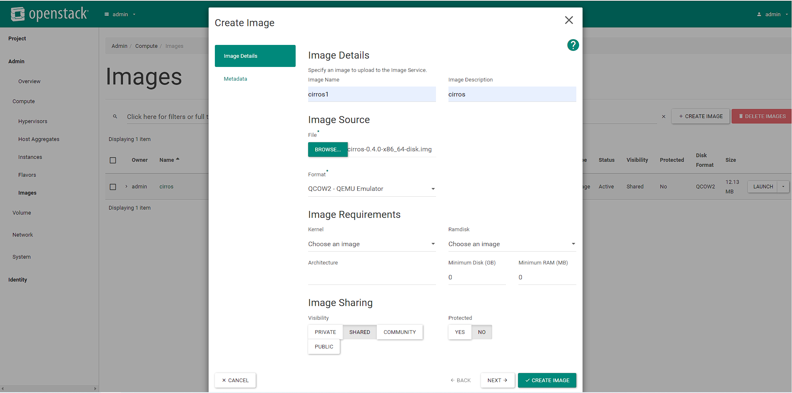

- Using CLI:

```

// List all image
$openstack image list

// Delete image
$openstack image delete IMAGE

// Describe a image
$openstack image show IMAGE

// Update image
$openstack image set IMAGE

// Upload a raw image
$openstack image create "cirros-raw" --disk-format raw \
  --container-format bare --shared \
  --file ~/images/cirros-0.4.0-x86_64-disk.img

```

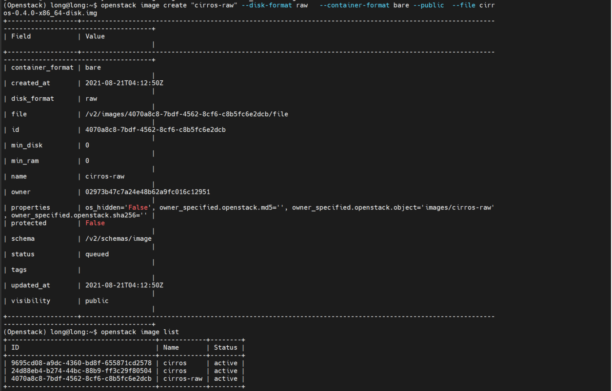

## 4. Create Volume & Manage volume

- Create a new volume:

```
openstack volume create --size SIZE_IN_GB NAME
```

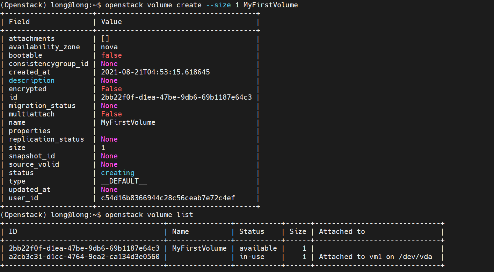

- Attach volume to Instance after the instance is active, and the volume is available

```
$openstack server add volume INSTANCE_ID VOLUME_ID

$openstack server add volume VolumeInstance 2bb22f0f-d1ea-47be-9db6-69b1187e64c3
```

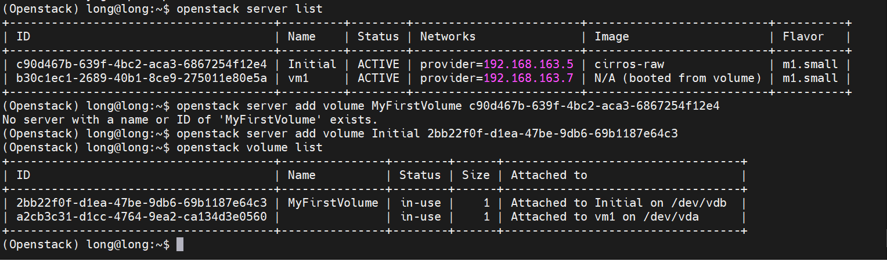

## 5. Create New Virtual Machine

- Go to `Project` => `Compute` => `Instance` => `Launch Instance`. Config all information like network, flavor, source, ... for your VM.

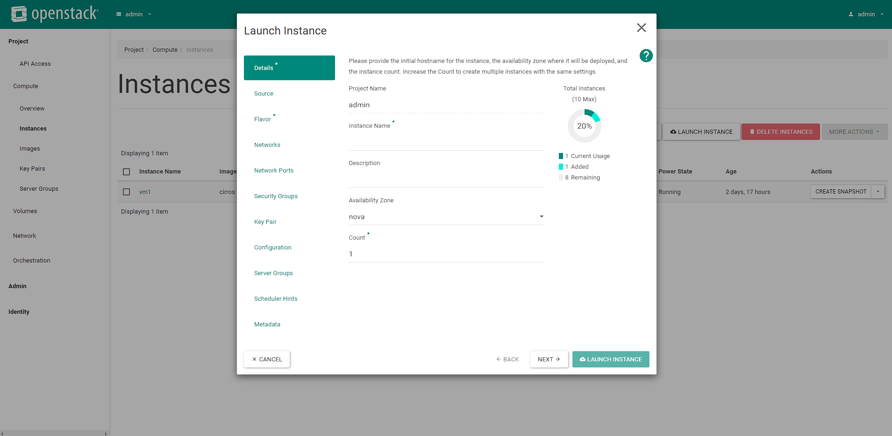

- Choose images for your VM.

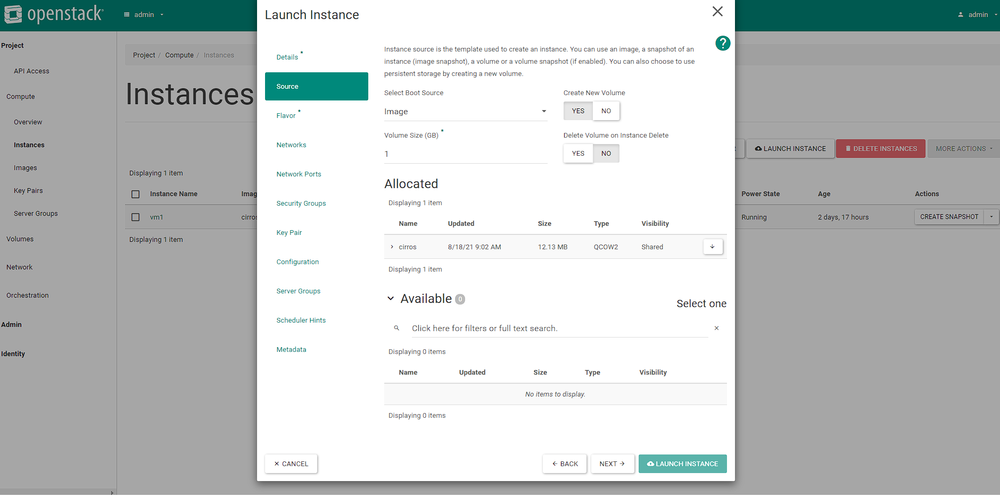

- Choose your VM configuration.

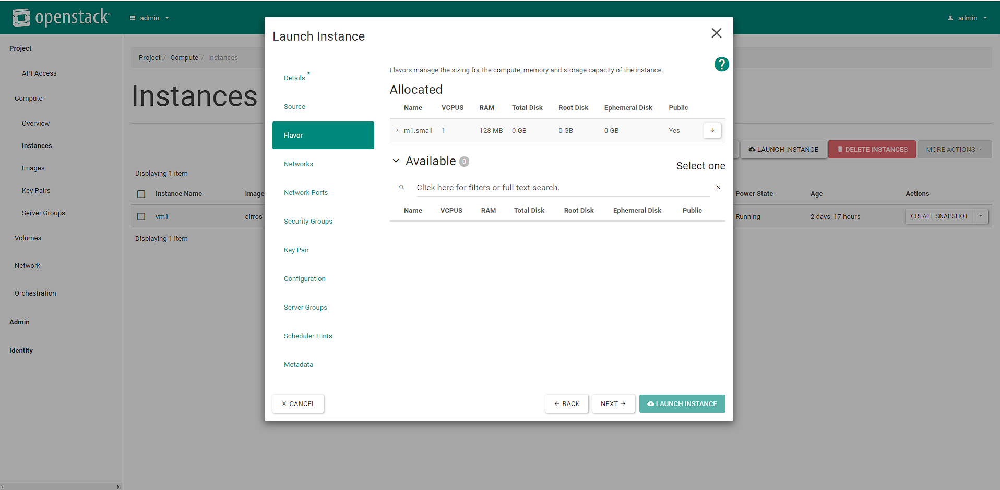

- Choose your VM network subnet.

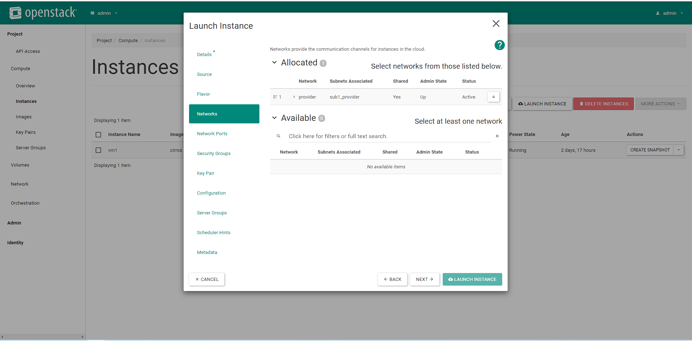

=> Then, choose `Launch Instance` to create your VM.

Result:

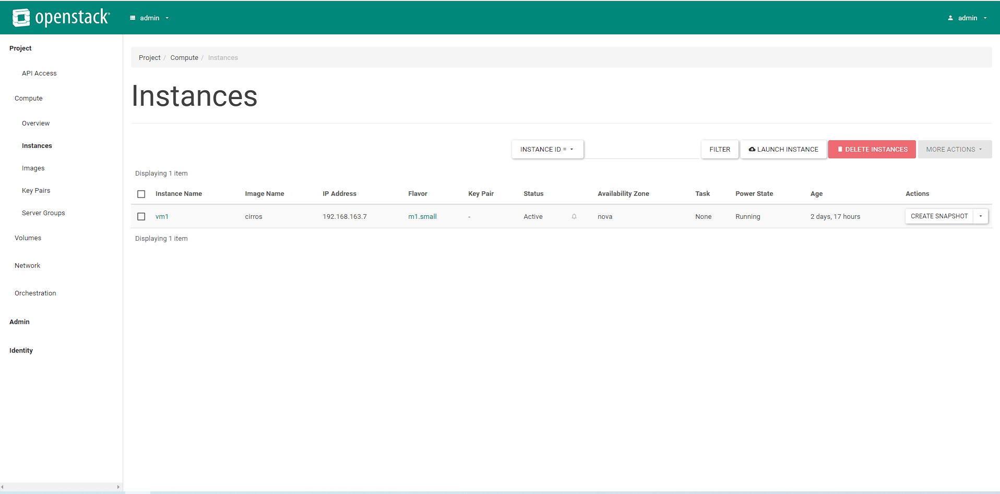

- Boot an Instance using flavor and image name(if names are unique)

```
$openstack server create --image IMAGE --flavor FLAVOR INSTANCE_NAME

$openstack server create --image cirros-raw --flavor m1.small \Initial
```

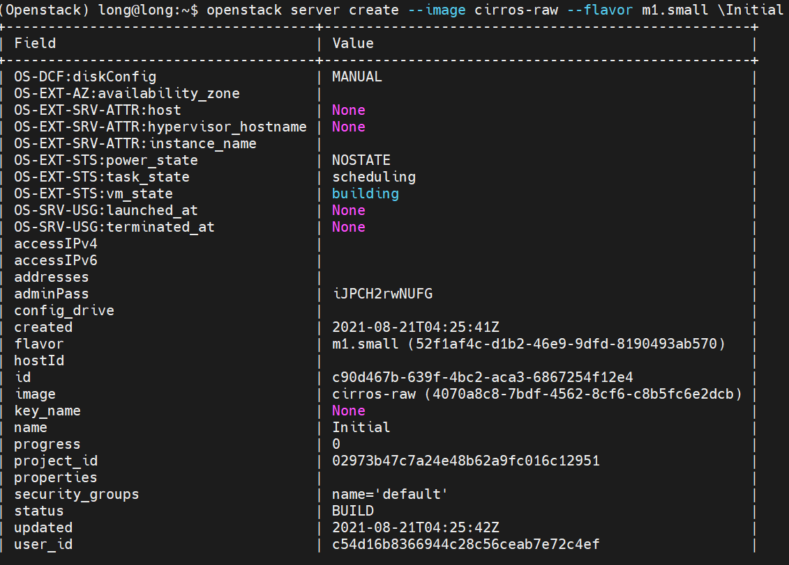
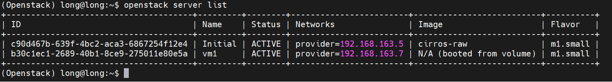

## 6. Security Group

- To `ping` from VM to outside or `ssh` to VM you need add some rules in `security group`. Go to `Project` => `Network` => `Security Group` => `Manage Rules`.

- Then choose `Add rule`. You can add `ICMP` and `SSH` rule to allow SSH and Ping.

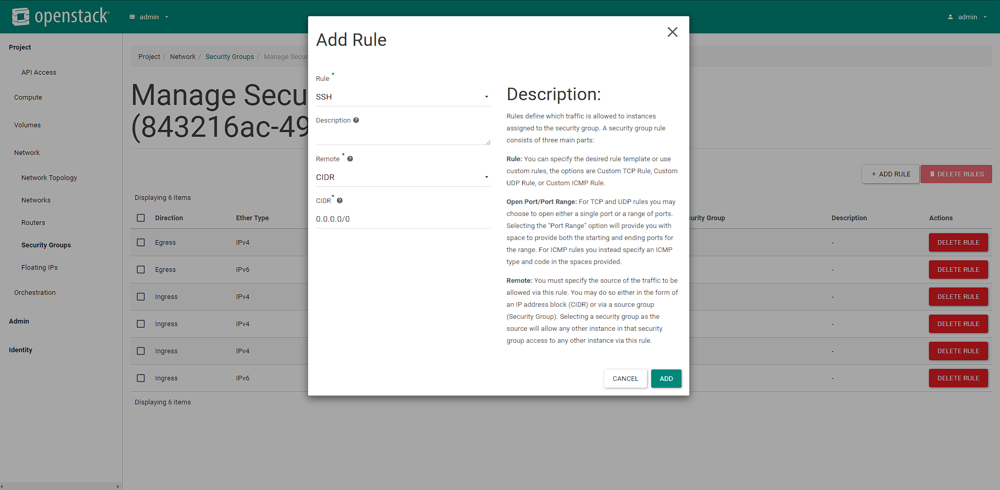

- After add rules
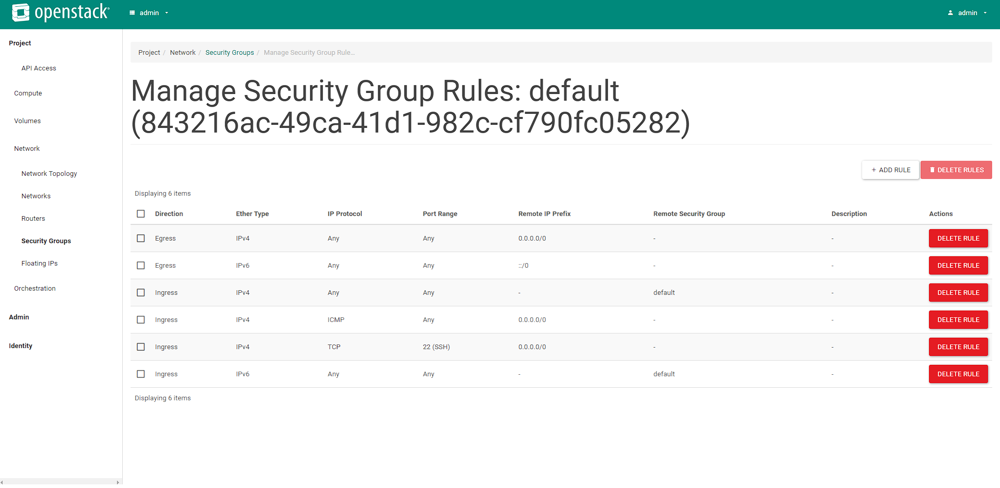

- In CLI:
- To list the rules for a security group:

 ```
 $openstack security group rule list SECURITY_GROUP_NAME
 ```

- To allow `SSH` access to the instances (Allow access from all IP addresses, specified as IP subnet 0.0.0.0/0 in CIDR notation)

 ```
 $openstack security group rule create SECURITY_GROUP_NAME --protocol tcp --dst-port 22:22 --remote-ip 0.0.0.0/0
 ```

- To allow `pinging` of the instances (Allow pinging from all IP addresses, specified as IP subnet 0.0.0.0/0 in CIDR notation):

 ```
 $openstack security group rule create --protocol icmp SECURITY_GROUP_NAME
 ```

- Now you can `ssh` or `ping` to your VM have created before.

- `Login` or `Pinging` to the instance (from Linux)

```
#ip netns

#ip netns exec NETNS_NAME ssh USER@SERVER

#sudo ip netns exec qdhcp-3dc8caae-a367-4487-9d20-68023f464ff1 ssh cirros@192.168.163.7

#sudo ip netns exec qdhcp-3dc8caae-a367-4487-9d20-68023f464ff1 ping 192.168.163.7
```

- Test SSH to Instance

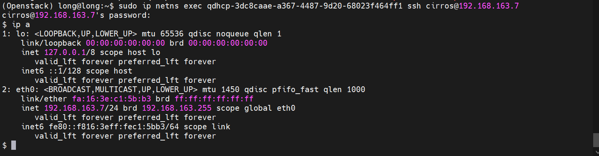

- Test Ping to Instance

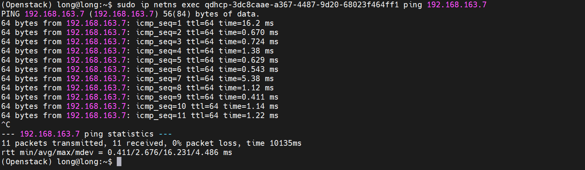
