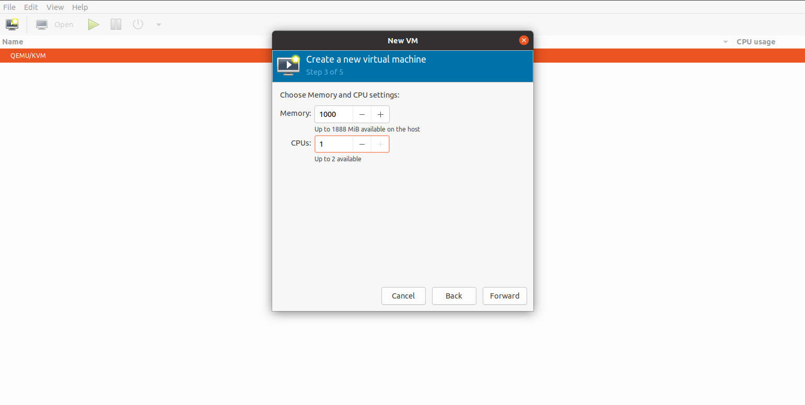

## 1. Install KVM

- Firstly, you need to check if your system support KVM or not by using this command:

```
# egrep -c '(vmx|svm)' /proc/cpuinfo
or
# grep -c -E '(vmx|svm)' /proc/cpuinfo
```

> If it return `0` -> KVM can not running and your system not support VMX or SVM virtualize hardware. If it is `1` or something else it mean your system already to install KVM.

- If you using VMware you can turn on support virtualization feature here:


- **Install KVM** and some package involve:

> Note: In this lab I install in **ubuntu 20.04**  

```
long@longvm:~$ sudo apt update
long@longvm:~$ sudo apt-get install qemu-kvm libvirt-daemon-system libvirt-clients bridge-utils virt-manager -y
```

> Note:
>
> - qemu-kvm : essential extention for KVM
>
> - lib-virt-daemon-system : provide libvirt to manage `QEMU` and `KVM` via `libvirt`
>
> - bridge-utils: create and manage bridge device
>
> - virt-manager: provide `desktop interface` to manage VM
>

- Checking KVM/QEMU is successfully install:

```
root@longvm:~# virsh -c qemu:///system list
 Id   Name   State
--------------------
```

- Use `systemctl` command to check status of `libvirtd`:

```
root@longvm:~# systemctl status libvirtd
```


-

- To add `user` to manage VM KVM:

```
long@longvm:~$ sudo adduser <username> libvirt
```

## 2. Note

- Path to config file:

```
/etc/libvirt
```

- Pool of VM:

```
/var/lib/libvirt/images
```

- File log:

```
/var/log/libvirt/qemu
```

## 3. Create a VM on Ubuntu 20.04

- Before you choose one of two method bellows, make sure you have installed `virt-manager`  to creating and managing VMs before.

### 3.1 Method 1: Using Virt Manager GUI

- Start virt-manager with:

```
root@longvm:~# virt-manager
```

- In the first window, click the computer icon in the upper-left corner. Then, select option install VM using an ISO image then click `Forward`.


- Choose your ISO file then forward and configure RAM, CPU, Disk space you wish to allocate to the VM then Forward.




- The VM start automatically, prompting you start installing the OS that's on the ISO file


- Work with VM:


- Note:
  - All configure to VM has been apply when turn off VM
  - Ctr + Alt to exit of VM monitor
  - You can `clone` or `delte` VM

- `VM Network` management:
  - `Edit` -> `Connection Details` -> `Virtual network`


### 3.2 Method 2: Using Command Line

- Use the `virt-install` command to create a VM via Linux terminal. The syntax is:

```
virt-install --option1=value --option2=value ...
```

**Example**: I using command line to install a VM Ubuntu 20.04 live server:

```
virt-install \
--connect qemu:///system \
--name ubuntu20 \
--ram 1024 \
--disk path=/var/kvm/images/ubuntu20.img,size=3 \
--vcpus 1 \
--os-type linux \
--os-variant ubuntu20.04 \
--network bridge=br0 \
--graphics none \
--console pty,target_type=serial \
--location /home/ubuntu-20.04.2-live-server-amd64.iso,kernel=casper/vmlinuz,initrd=casper/initrd \
--extra-args 'console=ttyS0, 115200n8 serial'
```

```
- name: name of VM
- ram: ram of VM
- vcpus: number cpu of VM
- disk: path to location of disk for VM
- size: size of disk
- os-type: specify the type of GuestOS
- os-variant: specify the kind of GuestOS - possible to confirm the list with the command below
  # osinfo-query os
- network: configure a guest network interface
- graphics: specify the kind of graphics. if set 'none', it means nographics
- console: specify the console type
- location: specify the location of installation where from
- extra-args: specify parameters that is set in kernel
```


```
long@longvm:~$ sudo virsh -c qemu:///system list
[sudo] password for long: 
 Id   Name        State
---------------------------
 3    ubuntu204   running
 4    ubuntu20    running
```

## REFERENCE

[https://github.com/hocchudong/thuctap012017/blob/master/TamNT/Virtualization/docs/KVM/2.Cong_cu_quan_ly_KVM.md#1](https://github.com/hocchudong/thuctap012017/blob/master/TamNT/Virtualization/docs/KVM/2.Cong_cu_quan_ly_KVM.md#1)

[https://github.com/hocchudong/KVM-QEMU](https://github.com/hocchudong/KVM-QEMU)

[https://computingforgeeks.com/virsh-commands-cheatsheet/](https://computingforgeeks.com/virsh-commands-cheatsheet/)

[https://github.com/khanhnt99/internship-2020/tree/master/KhanhNT/Virtualization/KVM-QEMU](https://github.com/khanhnt99/internship-2020/tree/master/KhanhNT/Virtualization/KVM-QEMU)

[https://www.server-world.info/en/note?os=Ubuntu_20.04&p=kvm&f=2](https://www.server-world.info/en/note?os=Ubuntu_20.04&p=kvm&f=2)
