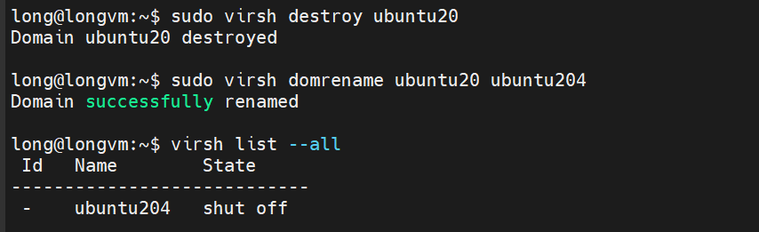
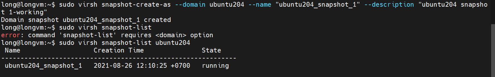
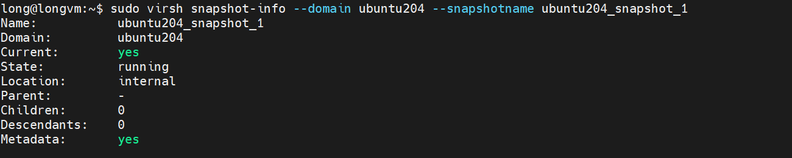
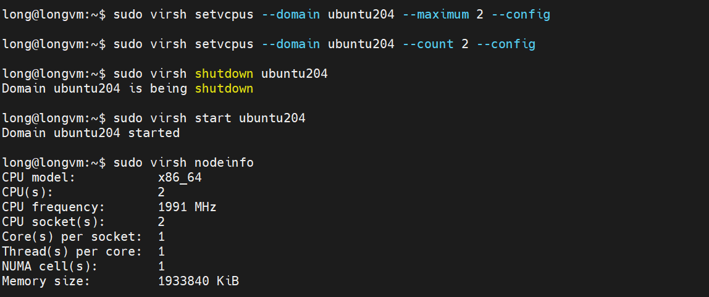
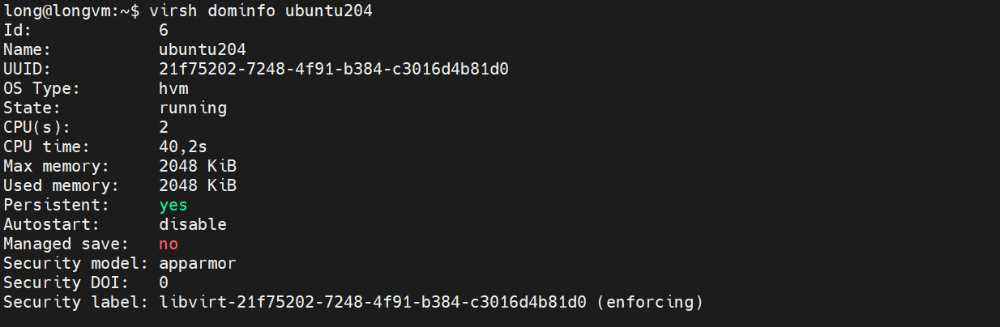

## Virsh command

- `Virsh` is a management use interface for virsh guest domain. Virsh can be used to create, pause, restart, shutdown domains ...

- `Virsh` interacts with Libvirt which is a library aimed at pronviding long-term stable C API. It currently support QEMU, KVM, VirtualBox and VMware,...

- `Virsh` is tools which support interact with `libvirtd`, it have installed when you install `libvirt-bin` but `virt` need to install separately

- `Virsh` not interact directly with `libvirtd` to use resource. It's use resource which manage by `hypervisor` via execute `XML` file

- `Virsh` inly manage on localhost.

## Using Virsh command

- Install:

```
# apt-get install libvirt-bin
```

### Common command

- Command structure:
  - `virsh [option]...<command> <domain> [ARG]...`

- View node info:

```
# virsh nodeinfo
```

**Example**

```
long@longvm:~$ sudo virsh nodeinfo
CPU model:           x86_64
CPU(s):              2
CPU frequency:       1991 MHz
CPU socket(s):       2
Core(s) per socket:  1
Thread(s) per core:  1
NUMA cell(s):        1
Memory size:         1933840 KiB

```

- Virsh list all VM:

```
# virsh list [--all] [--inactive]
# virsh list // list only active domain
```

**Example**

```
long@longvm:~$ virsh list --all
 Id   Name       State
-------------------------
 3    ubuntu20   paused
```

- Virsh rename domain

```
# virsh domrename <currentname> <newname>
```



- Virsh start VMs

```
# virsh start <domain name>
```

- Set auto start a domain on system startup

```
# virsh autostart <domain name>
# virsh autostart --disable <domain name> //disable autostart
```

- Shut down, stop, force shutdown VMs

```
# virsh shutdown <domain name> // shutdown a running vm
# virsh destroy <domain name> // force shutdown of active domain
```

**Example**

```
long@longvm:~$ sudo virsh destroy ubuntu20
Domain ubuntu20 destroyed
```

```
// to shutdown all running domains
# for i in `sudo virsh list | grep running | awk '{print $2}'` do
    sudo virsh shutdown $i
done
```

- Virsh Reboot VM:

```
# virsh reboot test
```

- Virsh suspend VM, resume VM

```
# virsh suspend <domain name> // suspend VM
# virsh resume <domain name> // resume VM
```

- Virsh remove VM
  - To cleanly remove a vm including its storage columes, use the commands shown below

  ```
    sudo virsh destroy <domain name> 2> /dev/null
    sudo virsh undefine  <domain name>
    sudo virsh pool-refresh default
    sudo virsh vol-delete --pool default <domain name>.qcow2
  ```

  - You can also use undefine with–remove-all-storage option:

  ```
  # virsh undefine test --remove-all-storage
  ```

### Virsh Manage Snapshots

- Create a Snapshot for a VM

```
$sudo virsh snapshot-create-as --domain ubuntu20 --name "ubuntu20_snapshot_1" --description "ubuntu20 snapshot 1-working"
```

- List avaiable snapshot for a VM

```
$sudo virsh snapshot-list <vm name>
```



- Virsh display info about a snapshot:

```
$sudo virsh snapshot-info --domain <vm name> --snapshotname <snapshot name>
```



- Virsh revert VM snapshot

```
$sudo virsh snapshot-revert --domain <vm name> --snapshotname <snapshot name> <state of snapshot>
```

- Virsh delete snapshot

```
$sudo virsh snapshot-delete --domain <vm name> --snapshotname <sanpshot name>
```

- Clone a VM:

```
$sudo virt-clone --connect qemu:///system --original <name of vm your want to clone> --name <clone vm name> --file <path to file save your clone images file>
```

- Manage VM vCPUs , RAM:
  - vCPUs:

    ```
    //add additional virtual cpus to a virtual machine
    $ sudo virsh setvcpus --domain <vm name> --maximum <maximum of cpus> --config
    $ sudo virsh setvcpus --domain <vm name> --count <number cpu of vm vCPU> --config
    $ sudo virsh shutdown <vm name>
    $ sudo virsh start <vm name>
    ```

    

  - RAM:

    ```
    // adjust the total ram used by the guest operating system
    # In MB
    $ sudo virsh setmaxmem <vm name> <maximum of ram> --config
    $ sudo virsh setmem <vm name> <memory of vm RAM> --config
    $ sudo virsh shutdown <vm name>
    $ sudo virsh start <vm name>
    ```

    

### Virsh Manage Volumes

- Create volume:

  ```
  $sudo virsh vol-create-as <name of the associated storage pool> < name of the new storage volume> <capacity - size of storage volume use suffixes b,k, M,G,T>
  ```

  ```
  Ex: create a 2GB volume named test_vol2 on the default storage pool
  $sudo virsh vol-create-as default test_vol2.qcow2 2G
  ```

- Attach a volume to VM:

  ```
  $sudo virsh attach-disk --domain <domain name> --source <path_to_new_volume> --persistent --target <target of a disk device>
  ```

- Delete volume:

  ```
  // delete a volume in default pool (/var/lib/libvirt/images)
  $sudo virsh vol-delete test_vol2.qcow2 --pool default Vol test_vol2.qcow2 deleted
  $sudo virsh pool-refresh default
  $sudo virsh vol-list default
  ```

- Display VM disk usage:

  ```
  $sudo virt-df -d -sg-ve-01
  ```
