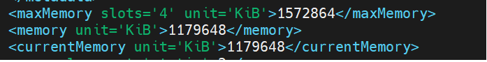
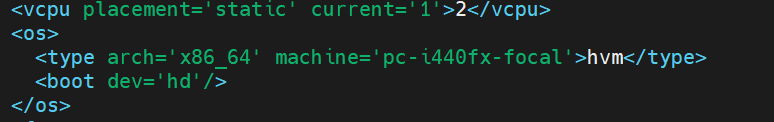
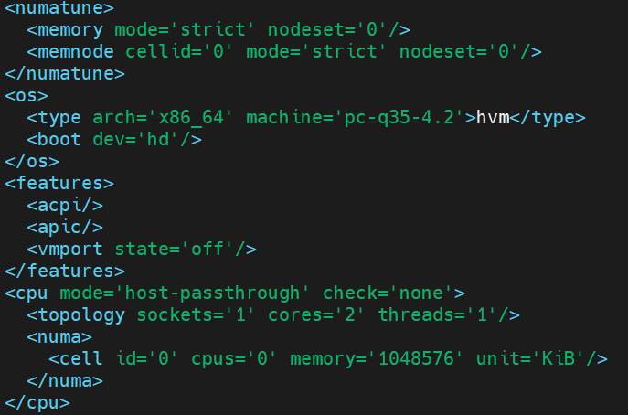
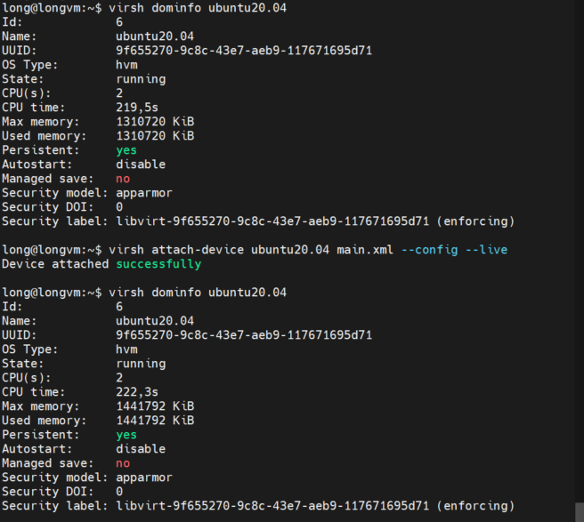
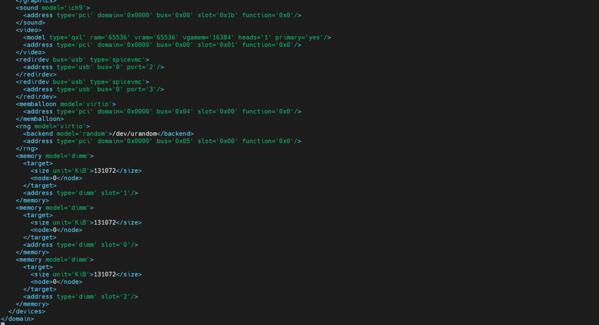
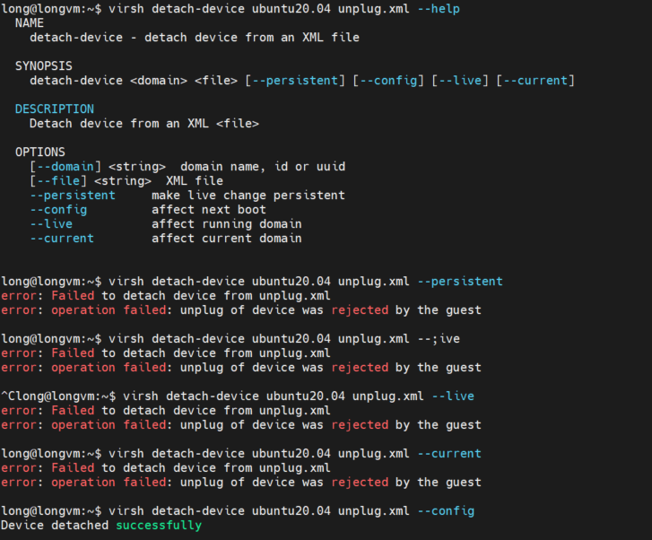
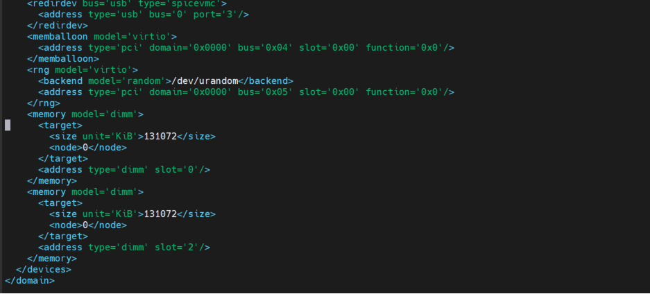
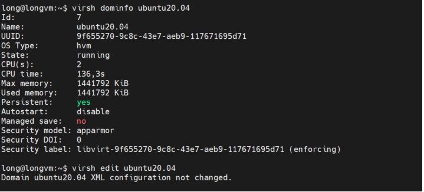
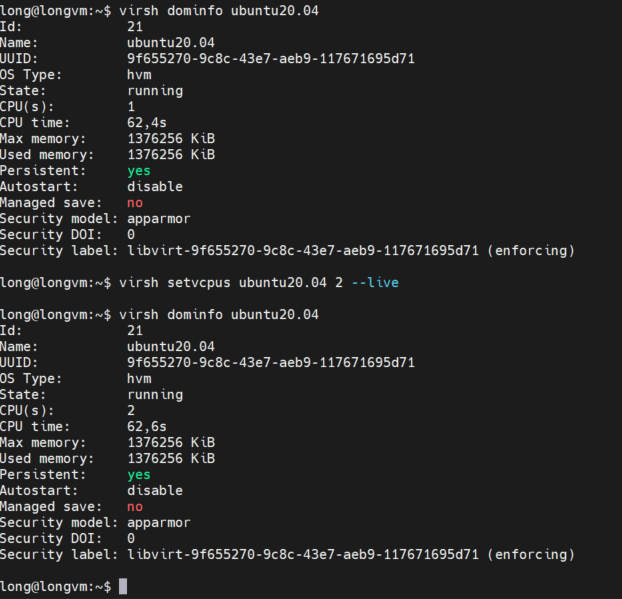

## Draft docs

- Hot plugging vCPUs/RAM : You can hot plug vCPUs or RAM. Hot plugging mean enabling or disabling devices while a VM is running. and OS automatically recognize the change.

> Note: Hot unpluging a vCPU is only supported if the vCPU was previously hotplugged. A VM's vCPUs cannot be hot unplugged to less vCPUs than it was originally created with.

### Did KVM/QEMU support hot-plug

- CPU/RAM hotplug is a controverse feature. It exist on qemu-kvm for some time now and according to some BZ movement, we known there are users for it

- Very few physical machine support it

- `PCI`( Peripheral COmponent Interconnect): is any piece of computer hardware that plugs directly into a PCI slot on a computer's motherboard

### vCPU, Memory hotplug QEMU

- Hot plugging of memory is supported since version 2.1 of QEMU and is an alternative to memory ballooning.

- Removing memory support since QEMU 2.4

- Configure changes:

- To tell `libvirt` we want to have memory hotplug there has to be a maxMemory element and a NUMA node declaration

- maxMemory specifies the maximum amount of memory that is allowed to be plugged in and behaves the same way as the memory attribute

- Second limiteation is the amount of modules that can be plugged

- `libvirt` currently enforces a specified NUMA node for memory hotplug. id specifies the node number and cpus which vcpus belong to this node. Even if not all vcpus are active, the maximum amount of vcpus shoud be specified here.

### Hotplug Memory

> Note: For my research until now only RHEL/CentOS 7 support hot unplug so in this tutorial I'm using ubuntu server 20.04 for testing and you can

- Firstly you need ensure your kernel support hot-plug:

- Configure your maxMemory of your guest OS by modify the configure (.`xml`) file of the guestOS:

```
// you can go to config file by
$ virsh edit <domain-name>

// Example
long@longvm:~$ virsh list
 Id   Name          State
-----------------------------
 4    cirros0.4.0   running
 6    ubuntu20.04   running

long@longvm:~$ virsh edit ubuntu20.04
```

- In configure file you modify the `maxMemory` with number of `slots` to hot add Memmory:



- for `vCPU` set vCPU current and vCPU maximum in my example i set my VM have maximum 2 vCPU and current is 1



- Configure `numatune` and modify `cpu` by add `topology` and `numa` tag:



- `virsh` requires an `XML` represent for a memory device. To add 128 MB, the `XML` file is:

```
<memory model='dimm'>
  <target>
    <size unit='MiB'>128</size>
    <node>0</node>
  </target>
</memory>
```

- To add it to the running guest and also add it to the config use following cmd:

```
virsh attach-device <vm-name> <xml file name> --config --live
```



- You can check your GuestOS info with command `virsh edit <domain-name>` and you can see your device has been plug in to your VM.



- To detach  `memory` you just making a xml file with diff file name like `unplug.xml` with the `same content` with the `xml` file which represent memory device you want plug to your VM then run this command:

```
virsh detach-device <vm-name> <xml file name> --config
```

> Note: you can detach device or not it depend for your guestOS. For me in UbuntuServer and Cirros0.4.0 `not` support hot remove you must reboot your guestOS after remove device. I will test in many diff GuestOS anf update soon.

- You can see can't not deatch device and affect on a running domain it's only work with options `--config` and affect on the next boot






### vCPU hotplug and hot unplug

- After config in the maximum of CPU in your Guest you can add some vCPU to your VM

```
// change the number of virtual CPUs active in a guest domain

virsh setvcpus domain count [--maximum] [[--config] [--live] | [--current]] [--hotpluggable]

count:  Specifies the number of virtual CPUs to set.

--maximum: set maximum vCpus can be hot plugged the next time domain is booted

--config: the change of vCPUS is made to the stored CML configuratuon for the guest domain, and will only take effect when tho guest domain is next started

--live: the changed takes place immediately

--current:  it is equivalent to either --live or --config, depending on the current state of the guest.

--hotpluggable: To allow adding vcpus to persistent definitions that can be later hotunplugged after the domain is booted it is necessary to specify the --hotpluggable flag. 
```

```
// hot plug
virsh setvcpus <domain name> <number of vcpu> --live

// hot-unplug

virsh setvcpus <domain name> <number of vcpu> --live 
```


