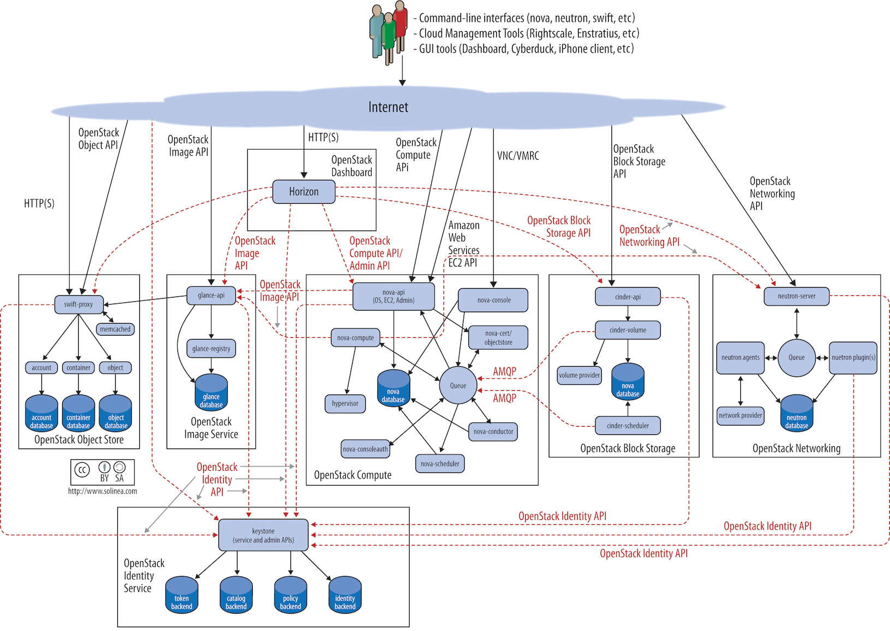
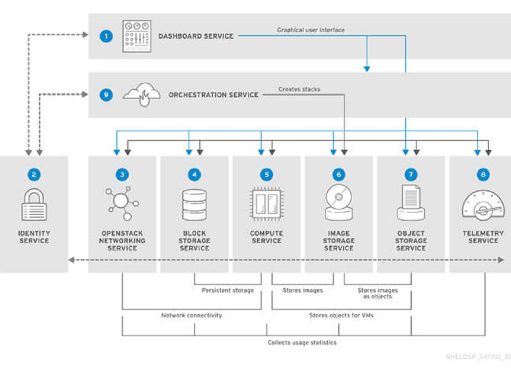

# OpenStack

- OpenStack is a cloud operating system that controls large pools of compute, storage, and networking resources throughout a datacenter, all managed and provisioned through APIs with common authentication mechanisms.

- A dashboard is also available, giving administrators control while empowering their users to provision resources through a web interface.

- Communicate via API

# 1. Openstack Component

- OpenStack architecture

- Openstack core component

- Dashboard <=> Horizon
- Identify <=> Keystone
- COmpute system <=> Nova
- Network Switch <=> Neutron
- Image <=> Glance
- Object Storage <=> Swift
- Block Storage <=> Cinder
- Orchestration Service <=> Heat

## 1.1 Horizon - Dashboard

- Horizon is the canonical implementation of OpenStack's dashboard, which is extensible and provides a web based user interface to OpenStack services.

## 1.1 Keystone - Identify Service

- Keystone is an OpenStack service that provides API client authentication, service discovery and distributed multi-tenant authorization by implementing OpenStack’s Identity API. It supports LDAP, OAuth, OpenID Connect, SAML and SQL.

## 1.2 Nova - Compute Service

- To implement services and associated libraries to provide massively scalable, on demand, self service access to compute resources, including bare metal, virtual machines, and containers.

## 1.3 Neutron - Networking Service

- OpenStack Neutron is an SDN networking project focused on delivering networking-as-a-service (NaaS) in virtual compute environments.

## 1.4 Glance - Image Service

- 

## 1.5 Swift - Object Storage Service

## 1.6 Cinder - Block Storage Service
